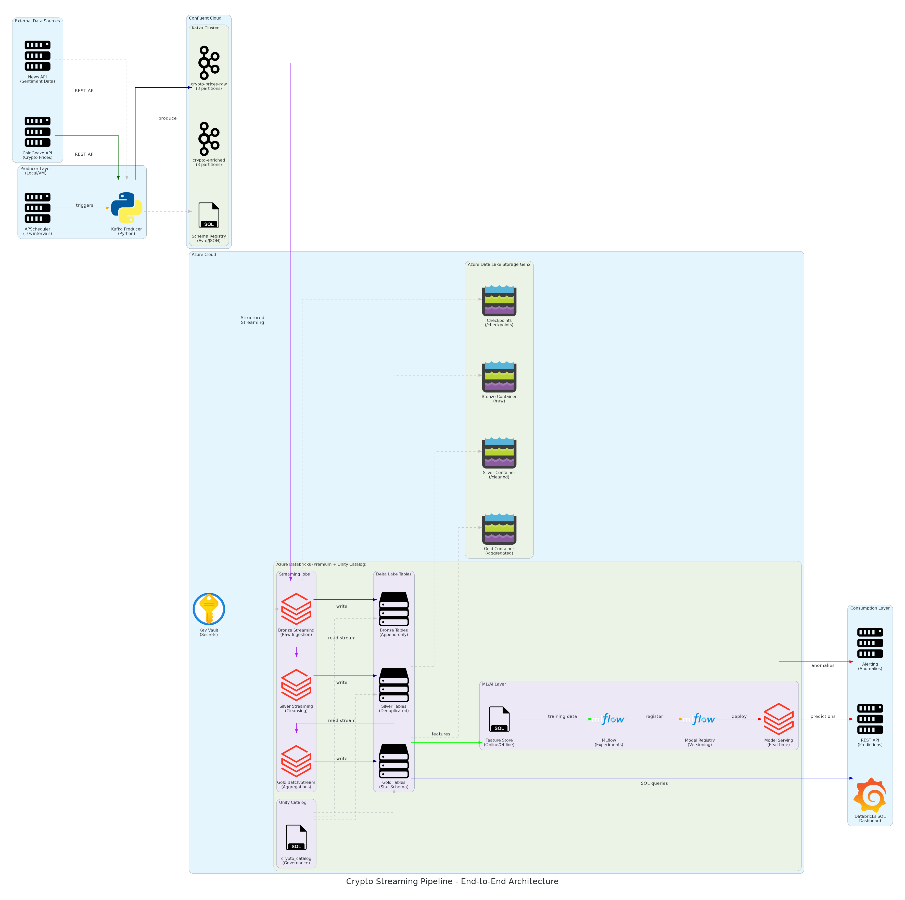

# 🚀 Crypto Real-Time Market Analytics Pipeline

[](https://www.python.org/)
[](https://www.confluent.io/)
[](https://www.databricks.com/)
[](https://delta.io/)
[](https://mlflow.org/)
[](https://azure.microsoft.com/)
[](https://opensource.org/licenses/MIT)

An end-to-end streaming data pipeline demonstrating modern data engineering practices. This project ingests real-time cryptocurrency market data, processes it through Apache Kafka, applies the Medallion Architecture in Databricks, and serves ML predictions—all with production-grade patterns.

---

## 📚 Table of Contents

- [🚀 Crypto Real-Time Market Analytics Pipeline](#-crypto-real-time-market-analytics-pipeline)
  - [📚 Table of Contents](#-table-of-contents)
  - [🎯 Overview](#-overview)
    - [What This Project Does](#what-this-project-does)
    - [Why This Architecture?](#why-this-architecture)
  - [🏗 Architecture](#-architecture)
    - [Component Breakdown](#component-breakdown)
  - [🛠 Tech Stack](#-tech-stack)
    - [Data Engineering](#data-engineering)
    - [ML / AI](#ml--ai)
    - [Development](#development)
  - [🔄 Data Flow](#-data-flow)
    - [Message Schema](#message-schema)
    - [Medallion Layers](#medallion-layers)
  - [📁 Project Structure](#-project-structure)
  - [🚀 Getting Started](#-getting-started)
    - [Prerequisites](#prerequisites)
    - [1. Clone and Setup Environment](#1-clone-and-setup-environment)
    - [2. Configure Credentials](#2-configure-credentials)
    - [3. Configure CLI Tools](#3-configure-cli-tools)
    - [4. Verify Connectivity](#4-verify-connectivity)
    - [5. Start the Producer](#5-start-the-producer)
    - [6. Deploy Databricks Notebooks](#6-deploy-databricks-notebooks)
  - [🔧 Pipeline Components](#-pipeline-components)
    - [Phase 1: Data Ingestion](#phase-1-data-ingestion)
    - [Phase 2: Bronze Layer](#phase-2-bronze-layer)
    - [Phase 3: Silver Layer](#phase-3-silver-layer)
    - [Phase 4: Gold Layer](#phase-4-gold-layer)
    - [Phase 5: ML \& Serving](#phase-5-ml--serving)
  - [📖 Key Concepts Demonstrated](#-key-concepts-demonstrated)
  - [📊 Monitoring \& Observability](#-monitoring--observability)
    - [Databricks SQL Dashboard](#databricks-sql-dashboard)
    - [Metrics Tracked](#metrics-tracked)
  - [🔮 Future Enhancements](#-future-enhancements)
  - [Author](#author)
  - [📄 License](#-license)
  - [🙏 Acknowledgments](#-acknowledgments)

---

## 🎯 Overview

### What This Project Does

This pipeline continuously ingests cryptocurrency price data from CoinGecko, streams it through Kafka, and processes it using Spark Structured Streaming into a lakehouse architecture. The end result is:

- **Real-time price tracking** for 10 major cryptocurrencies
- **Historical analytics** with minute/hour/day aggregations
- **Anomaly detection** for unusual price movements
- **Price predictions** served via REST API

### Why This Architecture?

This project mirrors real-world enterprise data platforms used by companies like Coinbase, Robinhood, and major financial institutions. It demonstrates:

| Pattern | Business Value |
|---------|----------------|
| **Streaming Ingestion** | React to market changes in seconds, not hours |
| **Medallion Architecture** | Progressive data quality with full lineage |
| **Delta Lake** | ACID transactions, time travel, schema enforcement |
| **Unity Catalog** | Centralized governance and access control |
| **MLflow** | Reproducible ML with model versioning |

---

## 🏗 Architecture



### Component Breakdown

```
┌─────────────────────────────────────────────────────────────────────────────────────┐
│                              DATA SOURCES                                            │
│  ┌─────────────────┐                                                                │
│  │   CoinGecko     │  Real-time prices for BTC, ETH, SOL, ADA, MATIC, LINK,        │
│  │   REST API      │  AVAX, DOT, UNI, LTC with 10-second polling                   │
│  └────────┬────────┘                                                                │
└───────────┼─────────────────────────────────────────────────────────────────────────┘
            │
            ▼
┌─────────────────────────────────────────────────────────────────────────────────────┐
│                              INGESTION LAYER                                         │
│  ┌─────────────────┐     ┌─────────────────────────────────────────┐               │
│  │ Python Producer │────▶│         Confluent Cloud (Kafka)         │               │
│  │ - APScheduler   │     │  ┌─────────────────────────────────┐    │               │
│  │ - JSON Schema   │     │  │ Topic: crypto-prices-raw        │    │               │
│  │ - Retry Logic   │     │  │ Partitions: 3 | Retention: 7d   │    │               │
│  └─────────────────┘     │  └─────────────────────────────────┘    │               │
│                          └─────────────────────────────────────────┘               │
└─────────────────────────────────────────────────────────────────────────────────────┘
            │
            ▼
┌─────────────────────────────────────────────────────────────────────────────────────┐
│                         AZURE DATABRICKS (Lakehouse)                                 │
│                                                                                      │
│  ┌──────────────────────────────────────────────────────────────────────────────┐   │
│  │                        MEDALLION ARCHITECTURE                                 │   │
│  │                                                                               │   │
│  │   ┌─────────────┐      ┌─────────────┐      ┌─────────────┐                  │   │
│  │   │   BRONZE    │      │   SILVER    │      │    GOLD     │                  │   │
│  │   │             │      │             │      │             │                  │   │
│  │   │ • Raw JSON  │ ───▶ │ • Cleaned   │ ───▶ │ • Aggregated│                  │   │
│  │   │ • Append    │      │ • Deduped   │      │ • Features  │                  │   │
│  │   │ • All data  │      │ • Typed     │      │ • Metrics   │                  │   │
│  │   │             │      │ • Validated │      │ • Star Schem│                  │   │
│  │   └─────────────┘      └─────────────┘      └─────────────┘                  │   │
│  │         │                    │                    │                           │   │
│  │         ▼                    ▼                    ▼                           │   │
│  │   ┌─────────────────────────────────────────────────────────────────────┐    │   │
│  │   │                    DELTA LAKE (ADLS Gen2)                           │    │   │
│  │   │   ACID Transactions | Time Travel | Schema Evolution | Z-Ordering   │    │   │
│  │   └─────────────────────────────────────────────────────────────────────┘    │   │
│  └──────────────────────────────────────────────────────────────────────────────┘   │
│                                                                                      │
│  ┌──────────────────────────────────────────────────────────────────────────────┐   │
│  │                           ML / AI LAYER                                       │   │
│  │                                                                               │   │
│  │   ┌─────────────┐      ┌─────────────┐      ┌─────────────┐                  │   │
│  │   │  Feature    │      │   MLflow    │      │   Model     │                  │   │
│  │   │  Store      │ ───▶ │  Training   │ ───▶ │  Serving    │                  │   │
│  │   │             │      │             │      │             │                  │   │
│  │   │ • Online    │      │ • Experiments│     │ • REST API  │                  │   │
│  │   │ • Offline   │      │ • Registry  │      │ • Real-time │                  │   │
│  │   └─────────────┘      └─────────────┘      └─────────────┘                  │   │
│  └──────────────────────────────────────────────────────────────────────────────┘   │
│                                                                                      │
│  ┌──────────────────────────────────────────────────────────────────────────────┐   │
│  │                         UNITY CATALOG                                         │   │
│  │          Centralized Governance | Lineage | Access Control | Audit           │   │
│  └──────────────────────────────────────────────────────────────────────────────┘   │
└─────────────────────────────────────────────────────────────────────────────────────┘
            │
            ▼
┌─────────────────────────────────────────────────────────────────────────────────────┐
│                            CONSUMPTION LAYER                                         │
│  ┌─────────────────┐   ┌─────────────────┐   ┌─────────────────┐                   │
│  │   Dashboards    │   │   REST API      │   │    Alerts       │                   │
│  │   (SQL Analytics)│   │   (Predictions) │   │   (Anomalies)   │                   │
│  └─────────────────┘   └─────────────────┘   └─────────────────┘                   │
└─────────────────────────────────────────────────────────────────────────────────────┘
```

---

## 🛠 Tech Stack

### Data Engineering

| Component | Technology | Purpose |
|-----------|------------|---------|
| **Message Broker** | Apache Kafka (Confluent Cloud) | Real-time event streaming with exactly-once semantics |
| **Stream Processing** | Spark Structured Streaming | Micro-batch processing with checkpoint recovery |
| **Storage Format** | Delta Lake | ACID transactions, time travel, schema enforcement |
| **Data Lake** | Azure Data Lake Storage Gen2 | Scalable, cost-effective object storage |
| **Compute** | Azure Databricks | Unified analytics platform with auto-scaling clusters |
| **Governance** | Unity Catalog | Centralized metadata, lineage, and access control |

### ML / AI

| Component | Technology | Purpose |
|-----------|------------|---------|
| **Experiment Tracking** | MLflow | Track parameters, metrics, and artifacts |
| **Model Registry** | MLflow Registry | Version control and stage transitions |
| **Feature Store** | Databricks Feature Store | Online/offline feature serving |
| **Model Serving** | Databricks Model Serving | Serverless REST endpoints |

### Development

| Component | Technology | Purpose |
|-----------|------------|---------|
| **Language** | Python 3.10+ | Producer, tests, local development |
| **Query Language** | SQL, PySpark | Transformations and analytics |
| **Infrastructure** | Azure CLI, Databricks CLI | Resource management |
| **CI/CD** | GitHub Actions | Automated testing and deployment |

---

## 🔄 Data Flow

### Message Schema

Each message published to Kafka follows this schema:

```json
{
  "coin_id": "bitcoin",
  "symbol": "btc",
  "price_usd": 43521.87,
  "market_cap_usd": 854123456789,
  "volume_24h_usd": 28456789012,
  "change_24h_pct": 2.34,
  "change_7d_pct": -1.23,
  "last_updated_at": "2025-12-20T15:30:00Z",
  "ingestion_timestamp": "2025-12-20T15:30:05Z"
}
```

### Medallion Layers

| Layer | Description | Update Frequency | Retention |
|-------|-------------|------------------|-----------|
| **Bronze** | Raw JSON exactly as received | Real-time (10s) | 90 days |
| **Silver** | Cleaned, deduplicated, typed | Real-time (10s) | 1 year |
| **Gold** | Aggregated metrics, features | Micro-batch (1m) | Indefinite |

---

## 📁 Project Structure

```
crypto-streaming-pipeline/
│
├── 📂 src/
│   ├── 📂 ingestion/
│   │   ├── producer.py           # Kafka producer with CoinGecko integration
│   │   ├── schemas.py            # Data schemas and validation
│   │   └── test_*.py             # Connectivity tests
│   │
│   ├── 📂 streaming/
│   │   ├── bronze_ingest.py      # Kafka → Bronze Delta table
│   │   ├── silver_transform.py   # Bronze → Silver transformations
│   │   └── gold_aggregate.py     # Silver → Gold aggregations
│   │
│   ├── 📂 transformations/
│   │   ├── cleansing.py          # Data quality functions
│   │   ├── deduplication.py      # Dedup logic
│   │   └── feature_engineering.py# Feature calculations
│   │
│   └── 📂 ml/
│       ├── feature_store.py      # Feature table definitions
│       ├── train_model.py        # Model training pipeline
│       └── serve_model.py        # Serving configuration
│
├── 📂 notebooks/
│   ├── 📂 bronze/
│   │   └── 01_bronze_ingestion.py
│   ├── 📂 silver/
│   │   └── 02_silver_cleansing.py
│   ├── 📂 gold/
│   │   └── 03_gold_aggregations.py
│   └── 📂 ml/
│       ├── 04_feature_engineering.py
│       ├── 05_model_training.py
│       └── 06_model_serving.py
│
├── 📂 config/
│   ├── kafka_config.py           # Kafka connection settings
│   ├── databricks_config.py      # Databricks settings
│   └── schema_definitions.py     # Centralized schemas
│
├── 📂 tests/
│   ├── test_producer.py
│   ├── test_transformations.py
│   └── test_features.py
│
├── 📂 docs/
│   ├── 📂 images/
│   │   └── crypto_pipeline_architecture.png
│   ├── setup.md
│   ├── medallion_architecture.md
│   └── ml_pipeline.md
│
├── 📂 docker/
│   └── docker-compose.yml        # Local Kafka for testing
│
├── .env.example                  # Environment template
├── .gitignore
├── requirements.txt
├── pyproject.toml
└── README.md
```

---

## 🚀 Getting Started

### Prerequisites

- **Python 3.10+**
- **Azure Account** with Databricks workspace (Premium tier with Unity Catalog)
- **Confluent Cloud Account** (free tier works)
- **Docker Desktop** (optional, for local Kafka testing)

### 1. Clone and Setup Environment

```bash
# Clone repository
git clone https://github.com/YOUR_USERNAME/crypto-streaming-pipeline.git
cd crypto-streaming-pipeline

# Create virtual environment
python3 -m venv .venv
source .venv/bin/activate  # On Windows: .venv\Scripts\activate

# Install dependencies
pip install -r requirements.txt
```

### 2. Configure Credentials

```bash
# Copy environment template
cp .env.example .env

# Edit with your credentials
vim .env  # or use your preferred editor
```

Required variables:
```bash
# Confluent Cloud
CONFLUENT_BOOTSTRAP_SERVERS=pkc-xxxxx.region.azure.confluent.cloud:9092
CONFLUENT_API_KEY=your-api-key
CONFLUENT_API_SECRET=your-api-secret

# Databricks
DATABRICKS_HOST=https://adb-xxxx.xx.azuredatabricks.net
DATABRICKS_PROFILE=your-profile

# CoinGecko (no key needed for free tier)
COINGECKO_API_BASE=https://api.coingecko.com/api/v3
```

### 3. Configure CLI Tools

```bash
# Azure CLI
az login
az account set --subscription "Your-Subscription-Name"

# Databricks CLI
databricks auth login --host https://your-workspace.azuredatabricks.net --profile azure-de-project
```

### 4. Verify Connectivity

```bash
# Test Kafka connection
python src/ingestion/test_kafka_connection.py

# Test CoinGecko API
python src/ingestion/test_coingecko.py

# Test Databricks
databricks catalogs list --profile azure-de-project
```

### 5. Start the Producer

```bash
# Run the Kafka producer (runs continuously)
python src/ingestion/producer.py
```

### 6. Deploy Databricks Notebooks

Import notebooks from `notebooks/` directory into your Databricks workspace and run in sequence:
1. `01_bronze_ingestion.py`
2. `02_silver_cleansing.py`
3. `03_gold_aggregations.py`

---

## 🔧 Pipeline Components

### Phase 1: Data Ingestion

**What it does:** Pulls real-time crypto prices and publishes to Kafka.

**Key concepts:**
- REST API polling with rate limiting
- Kafka producer configuration (acks, retries, idempotence)
- JSON serialization with schema validation

```python
# Simplified producer logic
def produce_prices():
    prices = fetch_from_coingecko()
    for price in prices:
        producer.produce(
            topic='crypto-prices-raw',
            key=price['coin_id'],
            value=json.dumps(price)
        )
    producer.flush()
```

---

### Phase 2: Bronze Layer

**What it does:** Lands raw data into Delta Lake with minimal transformation.

**Key concepts:**
- Spark Structured Streaming with Kafka source
- Checkpoint management for exactly-once processing
- Append-only pattern for full data lineage

```python
# Bronze ingestion pattern
(spark.readStream
    .format("kafka")
    .option("kafka.bootstrap.servers", bootstrap_servers)
    .option("subscribe", "crypto-prices-raw")
    .load()
    .writeStream
    .format("delta")
    .option("checkpointLocation", checkpoint_path)
    .toTable("crypto_analytics.bronze.raw_prices"))
```

---

### Phase 3: Silver Layer

**What it does:** Cleans, deduplicates, and validates data.

**Key concepts:**
- Schema enforcement and type casting
- Deduplication with watermarking
- Data quality checks with expectations

```python
# Silver transformation pattern
silver_df = (bronze_df
    .dropDuplicates(["coin_id", "last_updated_at"])
    .withColumn("price_usd", col("price_usd").cast("decimal(18,8)"))
    .filter(col("price_usd") > 0))
```

---

### Phase 4: Gold Layer

**What it does:** Creates business-level aggregations and features.

**Key concepts:**
- Window functions for time-based aggregations
- Slowly changing dimensions
- Pre-computed metrics for dashboards

```python
# Gold aggregation pattern
gold_df = (silver_df
    .groupBy(window("timestamp", "1 hour"), "coin_id")
    .agg(
        avg("price_usd").alias("avg_price"),
        max("price_usd").alias("high"),
        min("price_usd").alias("low"),
        sum("volume_24h_usd").alias("total_volume")
    ))
```

---

### Phase 5: ML & Serving

**What it does:** Trains prediction models and serves via REST API.

**Key concepts:**
- Feature Store for consistent feature serving
- MLflow experiment tracking and model registry
- Databricks Model Serving for low-latency inference

```python
# MLflow training pattern
with mlflow.start_run():
    model = train_price_predictor(features_df)
    mlflow.sklearn.log_model(model, "price_predictor")
    mlflow.log_metrics({"rmse": rmse, "mae": mae})
```

---

## 📖 Key Concepts Demonstrated

| Concept | Implementation |
|---------|----------------|
| **Streaming Ingestion** | Kafka producer with exactly-once semantics |
| **Medallion Architecture** | Bronze → Silver → Gold progressive refinement |
| **Delta Lake** | ACID transactions, time travel, Z-ordering |
| **Unity Catalog** | Catalog/schema/table governance hierarchy |
| **Structured Streaming** | Continuous processing with checkpoints |
| **Feature Engineering** | Technical indicators, rolling aggregations |
| **MLflow** | Experiment tracking, model registry, serving |
| **Data Quality** | Schema validation, null checks, range validation |

---

## 📊 Monitoring & Observability

### Databricks SQL Dashboard

The Gold layer powers a real-time dashboard showing:
- Current prices with 24h change
- Volume trends by coin
- Price anomaly alerts
- Model prediction accuracy

### Metrics Tracked

| Metric | Description |
|--------|-------------|
| `messages_produced` | Count of messages sent to Kafka |
| `processing_latency_ms` | Time from API fetch to Bronze landing |
| `dedup_rate` | Percentage of duplicate records removed |
| `model_inference_latency_ms` | Time for prediction endpoint |

---

## 🔮 Future Enhancements

- [ ] Add sentiment analysis from crypto news/Twitter
- [ ] Implement real-time anomaly detection with streaming ML
- [ ] Add Terraform for infrastructure-as-code
- [ ] Build CI/CD pipeline with GitHub Actions
- [ ] Add data contracts with Great Expectations
- [ ] Implement cost monitoring and optimization

---

## Author

**Matt Sikes**
- Data Engineer | AI/ML Specialist
- [LinkedIn] https://www.linkedin.com/in/matt-sikes/
- [GitHub] https://github.com/emsikes

---

## 📄 License

This project is licensed under the MIT License - see the [LICENSE](LICENSE) file for details.

---

## 🙏 Acknowledgments

- [CoinGecko](https://www.coingecko.com/) for the free crypto API
- [Confluent](https://www.confluent.io/) for Kafka cloud platform
- [Databricks](https://www.databricks.com/) for the lakehouse platform
- [Delta Lake](https://delta.io/) for the open table format
